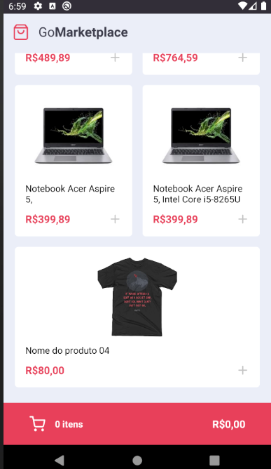
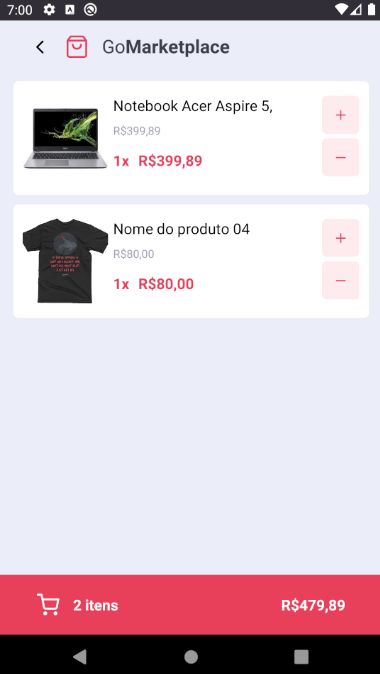

## Go MarketPlace Mobile!


> Aplicação mobile, desenvolvida com React-Native, durante exercicio do Bootcamp [Rocketseat](https://rocketseat.com.br/).

Para essa aplicação foi utilizado:
- React native.
- TypeScript.
- Context Api.
- Styled-Components.
- Json Api/ Json-Server
- Tests automatizados com Jest!


#### Para executar essa aplicação siga os passos abaixo:


>Dê um fork nesse repositório, e clone para sua maquina, abra o pasta, e execute o yarn para instalar as dependencias:

>use Yarn ou Npm

```js
//npm install
yarn

```

Coloque a Api Fake para rodar na porta 3333

```js
yarn json-server server.json -p 3333
```


Apos instale a aplicação no seu emulador ou no dispositivo Fisico:

```js
yarn android
```


e em sequencie execute a aplicação:

```js
yarn start
```


Para executar os testes:

```js
yarn test
```

>Imagens da Aplicação:








Obs: Essa aplicação foi desenvolvida,e testada apenas em ambiente Android, sendo assim, não consigo saber o resultado que ficou em dispositivos IOS.


### Aplicação desenvolvida durante bootcamp por [Fernando Santos](https://www.linkedin.com/in/fernando-santos-686632122/)
